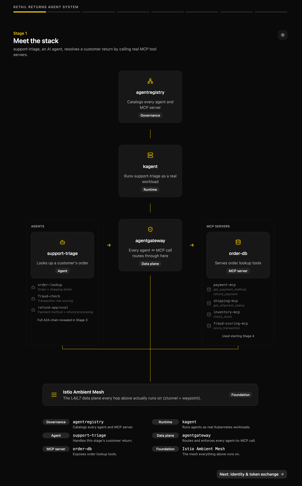

<div align="center">

# Retail Returns Agent System

*A guided tour of AI agents handling customer returns - built on kagent, agentregistry, and agentgateway.*


</div>

## What is this

This repo is the source for a demo where a small team of AI agents handles a customer's product return, step by step. 
You watch an agent look up an order, check it for fraud signals, and approve a refund, all backed by real infrastructure rather than a scripted mock.



## Repo layout

```
agents/
  support-triage/
  order-lookup/
  fraud-check/
  refund-approval/
mcp-servers/
  order-db/
  payment/
  shipping/
  inventory/
  fraud-scoring/
pii-guardrail/
stage-policy-controller/
ui/
```

## Learn more

For the full technical architecture (why these decisions were made, the
guided-tour stages, and the CRD mechanisms each stage relies on), see the
design doc in the `agentic-field-kit` repo.
